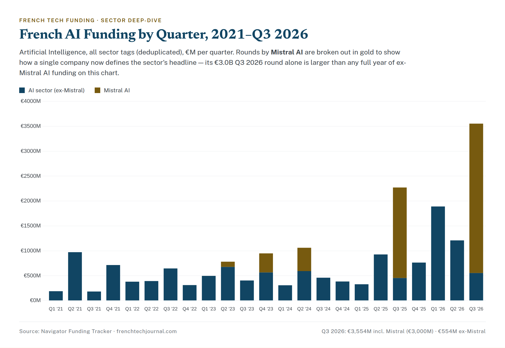

# French Frontier AI & the Compute-Capital Era — Q3 2026 Deep-Dive

> Companion sector report to the Q3 2026 French Tech Funding Report. AI was Q3's whole headline —
> €3.55B, 81% of the quarter — but €3.0B of it was a single company. This report separates the two
> markets that now live inside the word "AI" in France: **Mistral**, a global-scale frontier lab
> raising compute-sized cheques, and **everyone else** — a healthy but far smaller applied-AI sector
> that is, quietly, thinning. Data source: Navigator `funding_rounds` (all sector tags);
> comparison quarter Q3 2025.

---

## Executive summary

French **AI** raised **€3.55 billion across 57 deals** in Q3 2026 — the largest sum any sector has
posted in six years, and **81% of everything raised in the quarter.** But **€3.0 billion of it is
one round**: Mistral AI's September Series D, the largest venture financing in French history. Strip
Mistral out and AI raised **€554 million across 56 deals** — still France's single largest sector,
still up about **22% year-on-year**, but a completely different order of magnitude, and one that is
*shrinking* quarter-on-quarter within 2026 (€1.89B → €1.21B → €554M).

That split is the point. "AI" in France is now two markets wearing one label. One is a **compute-
capital** story — a frontier lab raising the kind of money that buys GPUs and data centers, from
global strategic investors, on a scale no French company has ever reached. The other is a **normal,
healthy applied-AI sector** — AI for cardiology, for life-sciences regulation, for scheduling — made
of €10–35M cheques. The first is the biggest thing that has ever happened to French tech. The second
is the market that actually tells you whether the ecosystem is deepening. Read them separately.

---

## The numbers

| Metric | Q3 2026 | Q3 2025 |
|---|---|---|
| AI deals (all tags) | 57 | 53 |
| AI total (incl. Mistral) | **€3,554M** | €2,272M |
| **AI ex-Mistral (core applied AI)** | **€554M** | €454M |
| Mistral's round | **€3,000M** (Series D) | €1,818M (Series C) |
| Mistral's share of AI | **84%** | 80% |
| Mistral's share of the whole quarter | **68%** | 60% |
| AI's share of all French funding | **81%** | 75% |

\* Each round is counted under all of its sector tags (the standard all-tags method). Mistral is
separated here so the underlying applied-AI market can be read on its own: **core AI raised €554M
across 56 deals**, up ~22% on a year ago in euros even as Mistral's single round nearly doubled.

---

## The compounding giant: Mistral's funding trajectory

Mistral AI has raised in every rhythm a frontier lab can, and each round has been a step-change. Our
tracker has the full arc:

| Round | Date | Amount | Lead(s) |
|---|---|---|---|
| Seed | Jun 2023 | €105M | Bpifrance |
| Series A | Dec 2023 | €383M | Andreessen Horowitz |
| Series B | Jun 2024 | €468M | Andreessen Horowitz |
| Series C | Sep 2025 | €1,818M | *(strategic-led)* |
| **Series D** | **Sep 2026** | **€3,000M** | **PSG Equity, Samsung Electronics, Scaleup Europe Fund** |

Three things stand out. First, the **cadence**: a landmark round every September for two years
running, each one roughly the size of all prior rounds combined. Second, the **investor shift** —
from a Bpifrance-led seed (French public money getting in first) through two a16z-led US venture
rounds to a Series D anchored by **strategic and industrial capital** (Samsung) and growth equity.
The money funding Mistral has graduated from venture to something closer to infrastructure finance.
Third, the **scale**: the €3.0B Series D alone is larger than every ex-Mistral AI round in France
*combined* over any single year on our chart. This is no longer a startup raising venture capital;
it is a national champion raising compute.

---

## Beneath the giant: a smaller, thinning applied-AI market

Here is the finding that the €3.55B headline hides. Set Mistral aside and look only at the other 56
AI rounds, and the sector is **declining through 2026**, not rising:

| Quarter | AI ex-Mistral, €M |
|---|---|
| Q1 2026 | 1,891 |
| Q2 2026 | 1,210 |
| **Q3 2026** | **554** |

Some of that is Q1's unusually large AI-adjacent rounds (AMI's €890M data-center play carries an AI
tag) rolling off. But the direction is clear: the **non-Mistral AI market has fallen for two
straight quarters**, and Q3's €554M, while up year-on-year, is the lowest ex-Mistral AI quarter of
2026. The breadth is thinning underneath the one name that keeps the headline rising.

And the **cheques are small and applied.** The largest genuinely AI-native rounds beneath Mistral in
Q3 were:

- **Arlequin AI — €28M, Series A, Paris.** AI-native, one of the quarter's few pure-play growth
  rounds in the sector.
- **Gradium — €26.3M, Seed, Paris.** An unusually large seed for an AI company — a rare bright spot
  in an early stage that is otherwise shrinking.
- **ZML — €17.2M, Seed, Paris.** Early-stage AI infrastructure.
- **Rayon (€10M) and Delos (€10M)** — Series A, Paris — the mid-table of AI-native fundraising.

The biggest non-Mistral "AI" cheques weren't AI companies at all in the frontier sense — they were
**AI applied to a vertical**: Skello (€150M, workforce scheduling), IMPLICITY (€35M, cardiac remote
monitoring), Biolevate (€30M, AI for life-sciences regulation). That is a healthy sign of diffusion
— AI as a feature of health, HR and fintech companies — but it is not a second frontier lab forming.

---

## What €3 billion is actually for

A €3.0B round is not a product round; it is a **compute** round. Frontier-model training is now a
capital-intensity problem — GPUs, data-center capacity and power — more than a software one, which is
why the Series D leaned on strategic and industrial backers (Samsung) and growth equity rather than
classic venture. It is the same logic that made **AMI's €890M** (Q1 2026) France's second-biggest
deal of the year: the money following AI is increasingly money for **infrastructure**, not just
algorithms. France's AI headline, in other words, is becoming a proxy for how much compute capital
the country can attract — a very different question from how many AI startups it is creating.

This is the **sovereign-compute thesis** in numbers: the belief that Europe needs a frontier lab and
the data-center capacity to run it, funded at a scale that only strategic and state-adjacent capital
can provide. Mistral is that bet. Whether it pays off defines not just a company but France's entire
AI funding line.

---

## Quarterly trajectory (AI, all-tags, €M)

*Artificial Intelligence, all sector tags (deduplicated), €M per quarter. Mistral's rounds are
broken out in gold. (Interactive source: `ai-quarterly-chart.html`.)*

The chart tells the whole story at a glance. For four years, French AI funding cycled in a normal
band — a few hundred million a quarter, occasionally brushing €1B in a strong one (Q2 2021, Q2 2025).
Then Mistral's rounds begin to tower: €1.82B in Q3 2025, €3.0B in Q3 2026, each one dwarfing the blue
(ex-Mistral) bar beneath it. **In the two quarters Mistral raised, it was roughly 80–84% of all AI
funding by itself.** The underlying sector (blue) is real and has grown modestly over six years — but
it has never once, in any quarter, matched a single Mistral round.

| Year | Q1 | Q2 | Q3 | Q4 |
|---|---|---|---|---|
| 2021 | 190 | 973 | 183 | 715 |
| 2022 | 381 | 393 | 647 | 313 |
| 2023 | 497 | 782 | 405 | 949 |
| 2024 | 308 | 1,062 | 461 | 385 |
| 2025 | 329 | 928 | 2,272 | 764 |
| 2026 | 1,891 | 1,210 | **3,554** | — |

*(All-tags. Mistral included: Q2'23 €105M, Q4'23 €383M, Q2'24 €468M, Q3'25 €1,818M, Q3'26 €3,000M.
Source: Navigator `funding_rounds`.)*

---

## Key trends

1. **"AI" is now two markets.** A compute-scale frontier lab (Mistral) and a normal applied-AI sector
   of €10–35M cheques. They move independently and should never be read as one number.
2. **The giant is compounding, not plateauing.** Mistral's rounds have roughly doubled each cycle
   (€468M → €1.82B → €3.0B) and its share of AI has risen to 84%. Single-company dependence in the
   sector is increasing, not easing.
3. **The applied-AI base is thinning in 2026.** Ex-Mistral AI has fallen two quarters running
   (€1.89B → €1.21B → €554M). Up year-on-year, but shrinking through the year.
4. **The capital is turning into infrastructure finance.** Mistral's Series D (Samsung, growth
   equity) and AMI's €890M data-center round show AI money increasingly funding compute and power,
   not just software — a different investor base and a different risk.
5. **Diffusion is the healthy signal.** The real breadth is AI showing up *inside* other sectors —
   health (IMPLICITY, Biolevate), HR (Skello), fintech — rather than in standalone model labs. That
   is maturation, even if it doesn't produce a second Mistral.

---

## The "is there a second lab?" question

The defining question for French AI is no longer whether it can produce a frontier champion — it has
one. It is whether it can produce a **second**, or whether Mistral remains a singularity: one company
absorbing the overwhelming majority of the sector's capital while everything beneath it stays
sub-€30M. There is no challenger in the data — no other French AI round cleared €50M in Q3 without a
vertical attached. The sovereign-compute bet is, for now, a bet on exactly one company.

---

## Outlook

French AI enters Q4 2026 with the strongest headline in its history and the narrowest base beneath
it. The watch-items are precise. **Does ex-Mistral AI stop falling** — does the €554M floor hold, or
keep sliding as 2026's big AI-adjacent rounds roll off? **Does a second €100M+ AI-native round
appear** — the first real evidence of a second pole? And **does Mistral raise again** — because if
its cadence holds, the single most important variable in France's entire annual funding number is one
company's next Series E. A frontier lab is a remarkable thing for an ecosystem to have. The risk is
mistaking one lab's balance sheet for the health of a sector.
